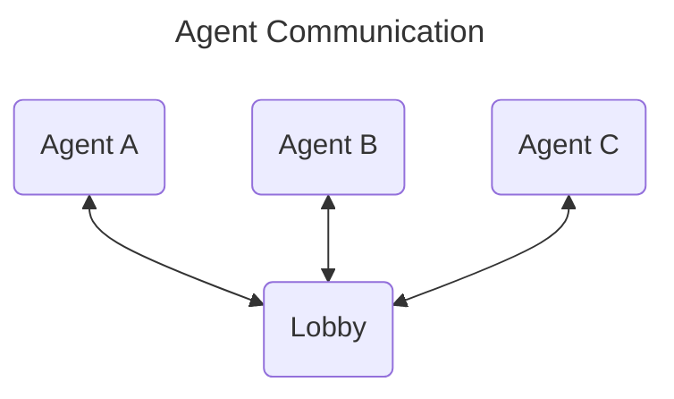
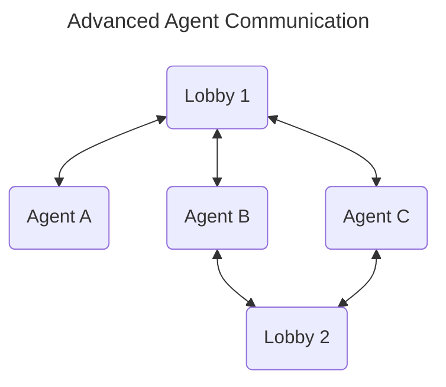

Exploring what a Rust based version of the Python based [autogen](https://github.com/microsoft/autogen) framework could look like.

## What does autogen provide?

Autogen provides decent documentation which is great. From the documentation it seems that autogen provides:

- Agents which are an abstraction over different APIs such as OpenAI and WolframeAlpha.
- A way to set up communication channels between agents.
- Documentation about how to use and tune your API calls.
- Examples of how you could utilize various AI platforms.

The documentation seems to exaggerate a bit how much it does for the actual models itself: "It maximizes the performance of LLM models and overcomes their weaknesses". As far as I can see it just provides different parameters to the APIs. The value here is perhaps in the documentation rather than the code.

## What does this repository illustrate?

This repository focuses on implementing agent communication with user interaction. Providing an abstraction over various APIs is not an interesting problem and may be solved already by other crates in the ecosystem. Rewriting the autogen documentation is also not an interesting problem. This leaves the communication part. 

The communication in Rust is easily implemented through proper application of channels. To organize communication between more than two parties we can use a "broadcast" channel. We use this channel to provide a `Lobby` of sorts. A lobby is a group chat where all messages are shared.

I have create two example agents: the "echo" agent and the "user" agent. The echo agent simply re-sends any messages it receives from other agents back to the lobby. The user agent prints out any messages received on `stdout` and allows sending messages. In the [test](src/lib.rs), messages are send automatically. In the [binary](src/main.rs), messages are read from `stdin`.

## Extensions

### Advanced agent communication schemes

To set up more complex interactions, we could create multiple lobbies. The agents would need to be extended to monitor multiple message subscriptions. To make it easy for users of this library to create agents with that functionality, we could create an abstraction that joins messages from multiple lobbies into a single channel. To dynamically join and leave lobbies, the agent's commands can be extended with `Enter(LobbyId, LobbySend)` and `Leave(LobbyId)` variants.

### Inter process agent communication.

To allow inter process communication, we simply have to define an agent that uses some inter process communication implementation, such as `Protobuf/TCP` or `HTTPS/TCP`, not unlike how an agent communicates with an API. We might want to think about making rate limiting part of this library.

### Agent abstraction

If you look at the current implementation there is no real need for an abstraction over agents. The time to add such an abstraction is when we need to handle agents generically, where the implementation is largely irrelevent.

### Extended message types

Currently the implementation supports text messages and an abstract byte buffer message for attachments. It is currently up to the agents to parse the attachment byte buffer. If we find that all agents need to do largely the same thing with this attachment, we could provide an abstraction. For example the attachment name might be something that is commonly relevant. We might also provide a more precise attachment variant, such as `MessageContents::Code` or `MessageContents::Image` to (deduplicate and) move the parsing from the agent implementation to the framework.
